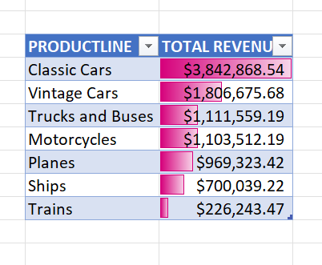

# Auto Sales Analysis
## PROJECT OVERVIEW
Analysis of Car sales Performance with the aid of Excel utilizing Pivot tables, slicers and charts. This project analyzes auto sales data to understand how different factors such as country, product line, and order status impact revenue and profitability. The dashboard provides insights into:
- Sales performance
- Product line performance
- Geographic distribution of sales
- Profitability
- Monthly sales trends

 ## TOOLS
- Data Cleaning
- Microsoft Excel
- Pivot Tables
- Pivot Charts
- Slicers

### ❓Key Business Questions that are looked into are: 
1. Which product lines generate the most revenue?
2. How do sales and profit vary across different countries?
3. How does order status affect overall performance?

  ### Interactive Dashboard Analysis :-Country & Status Filters

(
 
This section of the dashboard allows users to filter data by Country and Order Status.
When any value in the dropdown is clicked, it filters out sales and profit vlaues according to selected status or country. 
This dashboard provides insight on:
-	Sales and profit change significantly depending on the selected country.
- Some countries consistently generate higher revenue, indicating strong market demand.
- Order status (e.g., shipped, cancelled) directly impacts profit — cancelled or unresolved orders reduce overall profitability.
  This simply means that we can identify:
 1. High-performing regions to focus on.
 2. Problematic order statuses that may require operational improvement.

### Product Line Revenue Analysis

 
This table shows revenue by product line analysis with colored data bars to highlight performance levels. The essence of this table is to give insight on:
•	Certain product lines that clearly outperform others, as shown by longer data bars.
•	Lower-performing product lines may need marketing support or strategic review.
Therefore we can easily decide products that will be priortize or discontinued according to sales performance.

## CONCLUSION

The dashboard provides a clear view of sales performance according to Country, Status, Deal size and other important variables. This highlights key areas for business improvement as it provides easy view of profit and losses made on products in reltions to variables. For Example we notice that Order status has a direct impact on profitability, so to boost or increase profits, more work will be put into the successful delivery of products.

