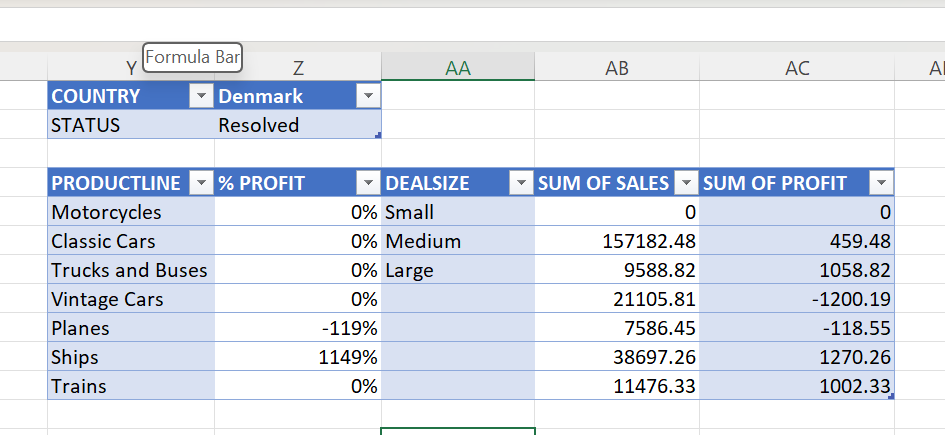

# Auto Sales Analysis
## PROJECT OVERVIEW
Analysis of Car sales Performance with the aid of Excel utilizing Pivot tables, slicers and charts. This project analyzes auto sales data to understand how different factors such as country, product line, and order status impact revenue and profitability. The dashboard provides insights into:
- Sales performance
- Product line performance
- Geographic distribution of sales
- Profitability
- Monthly sales trends

 ## TOOLS
- Data Cleaning
- Microsoft Excel
- Pivot Tables
- Pivot Charts
- Slicers

### ❓Key Business Questions that are looked into are: 
1. Which product lines generate the most revenue?
2. How do sales and profit vary across different countries?
3. How does order status affect overall performance?

   🌍 Interactive Analysis (Country & Status Filters)

(
 
This section of the dashboard allows users to filter data by Country and Order Status.
🔍 Insight:
•	Sales and profit change significantly depending on the selected country.
•	Some countries consistently generate higher revenue, indicating strong market demand.
•	Order status (e.g., shipped, cancelled) directly impacts profit — cancelled or unresolved orders reduce overall profitability.
💡 What this means:
Businesses can identify:
•	High-performing regions to focus on
•	Problematic order statuses that may require operational improvement

